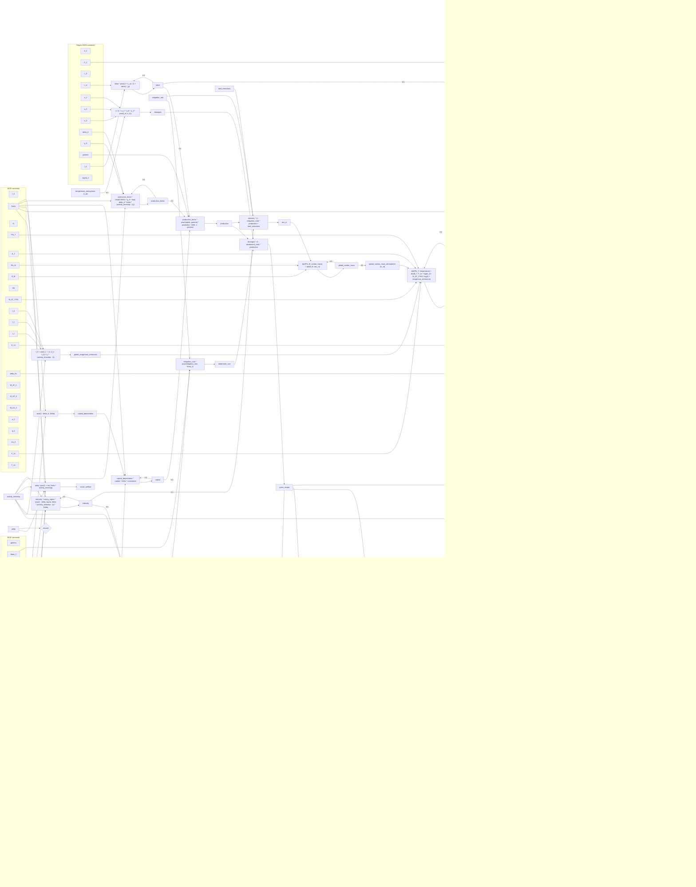

```mermaid
flowchart LR
    subgraph actions
    desired_imports
    max_export
    tariffs
    saving
    end
    subgraph constants
    num_regions
    balance_interest_rate
    init_capital_multiplier
    sub_rate
    dom_pref
    num_regions-->for_pref
    end
    subgraph DICE constants
    t_0
    Delta
    N
    Phi_T
    B_T
    Phi_M
    B_M
    eta
    M_AT_1750
    f_0
    f_1
    t_f
    E_L0
    delta_EL
    M_AT_0
    M_UP_0
    M_LO_0
    e_0
    q_0
    mu_0
    F_2x
    T_2x
    end
    subgraph RICE constants
    gamma_overwritten["gamma"]
    theta_2
    a_1_overwritten["a_1"]
    a_2_overwritten["a_2"]
    a_3_overwritten["a_3"]
    delta_K
    alpha
    rho
    L_0_overwritten["L_0"]
    L_a_overwritten["L_a"]
    l_g_overwritten["l_g"]
    A_0_overwritten["A_0"]
    g_A_overwritten["g_A"]
    delta_A_overwritten["delta_A"]
    sigma_0_overwritten["sigma_0"]
    g_sigma
    delta_sigma
    p_b
    delta_pb
    scale_1
    scale_2
    T_AT_0
    T_LO_0
    K_0_overwritten["K_0"]
    end
    subgraph Region RICE constants
    A_0
    K_0
    L_0
    L_a
    a_1
    a_2
    a_3
    delta_A
    g_A
    gamma
    l_g
    sigma_0
    end
    get_exogenous_emissions["f_0 + min(f_1 - f_0, (f_1 - f_0) / t_f * (activity_timestep - 1))"]
    get_land_emissions["E_L0 * pow(1 - delta_EL, activity_timestep - 1) / num_regions"]
    get_mitigation_cost["p_b / (1000 * theta_2) * pow(1 - delta_pb, activity_timestep - 1) * intensity"]
    get_damages["1 / (1 + a_1 * t_at + a_2 * pow(t_at, a_3))"]
    get_abatement_cost["mitigation_cost * pow(mitigation_rate, theta_2)"]
    get_production["production_factor * pow(capital, gamma) * pow(labor / 1000, 1 - gamma)"]
    get_gross_output["damages * (1 - abatement_cost) * production"]
    get_investment["saving * gross_output"]
    eq1["gov_balance* (1 + balance_interest_rate)"]
    eq2["clip(gov_balance_prev / init_capital_multiplier * K_0, -1, 0)"]
    eq3["clip_sum_at(desired_imports * gross_output, gross_output) * (1 + debt_ratio)"]
    get_max_potential_export["min(max_export * gross_output, gross_output - investment)"]
    eq4["clip_sum_at(desired_imports, max_potential_export)"]
    combine_trade["min(trade_gross_output_limited, trade_max_export_limited)"]
    get_investment["saving * gross_output"]
    eq5["imports * (1 - tariffs)"]
    eq6["imports * tariffs"]
    get_consumption["max(0, gross_output - investment - exports)"]
    get_armington_agg["(dom_pref * (domestic_consumption ** sub_rate) 
                        + sum(for_pref * pow(tariffed_imports, sub_rate)))
                        ** (1 / sub_rate)"]
    get_utility["(labor / 1000)
        * (pow(consumption / (labor / 1000) + 1, 1 - alpha) - 1)
        / (1 - alpha)"]
    get_social_welfare["utility / pow(1 + rho, Delta * activity_timestep)"]
    eq7["gov_balance_tmp + Delta * (sum(exports) - sum(imports))"]
    get_global_temperature["dot(Phi_T, temperature) + dot(B_T, F_2x * log(m_at / M_AT_1750) / log(2) + exogenous_emissions)"]
    get_aux_m["intensity * (1 - mitigation_rate) * production + land_emissions"]
    get_global_carbon_mass["dot(Phi_M, carbon_mass) + dot(B_M, aux_m)"]
    get_capital_depreciation["pow(1 - delta_K, Delta)"]
    get_capital["capital_depreciation * capital + Delta * investment"]
    get_labor["labor * pow((1 + L_a) / (1 + labor), l_g)"]
    get_production_factor["production_factor * (exp(0.0033) + g_A * exp(-delta_A * Delta * (activity_timestep - 1)))"]
    get_carbon_intensity["intensity * exp(-g_sigma * pow(1 - delta_sigma, delta * (activity_timestep - 1)) * Delta)"]

    E_L0-->get_land_emissions
    delta_EL-->get_land_emissions
    activity_timestep-->get_land_emissions
    num_regions-->get_land_emissions
    get_land_emissions-->global_land_emissions

    f_0-->get_exogenous_emissions
    f_1-->get_exogenous_emissions
    t_f-->get_exogenous_emissions
    activity_timestep-->get_exogenous_emissions
    get_exogenous_emissions-->global_exogenous_emissions

    p_b-->get_mitigation_cost
    theta_2-->get_mitigation_cost
    delta_pb-->get_mitigation_cost
    activity_timestep-->get_mitigation_cost
    intensity-->|t+1|get_mitigation_cost
    get_mitigation_cost-->mitigation_cost

    t_at["temperature_atmosphere (t_at)"]-->|t+1|get_damages
    a_1-->get_damages
    a_2-->get_damages
    a_3-->get_damages
    get_damages-->damages

    mitigation_rate-->get_abatement_cost
    mitigation_cost-->get_abatement_cost
    theta_2-->get_abatement_cost
    get_abatement_cost-->abatement_cost

    production_factor-->|t+1|get_production
    capital-->|t+1|get_production
    labor-->|t+1|get_production
    gamma-->get_production
    get_production-->production

    damages-->get_gross_output
    abatement_cost-->get_gross_output
    production-->get_gross_output
    get_gross_output-->gross_output

    gov_balance-->|t+1|eq1
    balance_interest_rate-->eq1
    eq1-->gov_balance_tmp

    saving-->get_investment
    gross_output-->get_investment
    get_investment-->investment

    gov_balance_tmp-->eq2
    init_capital_multiplier-->eq2
    K_0-->eq2
    eq2-->debt_ratio

    desired_imports-->|mine|eq3
    gross_output-->eq3
    debt_ratio-->eq3
    eq3-->trade_gross_output_limited

    max_export-->get_max_potential_export
    gross_output-->get_max_potential_export
    investment-->get_max_potential_export
    get_max_potential_export-->max_potential_export

    desired_imports-->|others|eq4
    max_potential_export-->eq4
    eq4-->trade_max_export_limited

    trade_gross_output_limited-->combine_trade
    trade_max_export_limited-->combine_trade
    combine_trade-->trade

    trade-->|imports|eq5
    tariffs-->|t+1|eq5
    eq5-->tariffed_imports

    trade-->|imports|eq6
    tariffs-->|t+1|eq6
    eq6-->tariff_revenue

    gross_output-->get_consumption
    investment-->get_consumption
    trade-->|exports|get_consumption
    get_consumption-->domestic_consumption

    domestic_consumption-->get_armington_agg
    tariffed_imports-->get_armington_agg
    sub_rate-->get_armington_agg
    dom_pref-->get_armington_agg
    for_pref-->get_armington_agg
    get_armington_agg-->consumption

    labor-->|t+1|get_utility
    consumption-->get_utility
    alpha-->get_utility
    get_utility-->utilty

    utility-->get_social_welfare
    rho-->get_social_welfare
    Delta-->get_social_welfare
    activity_timestep-->get_social_welfare
    get_social_welfare-->social_welfare

    gov_balance_tmp-->eq7
    Delta-->eq7
    trade-->|exports|eq7
    trade-->|imports|eq7
    eq7-->gov_balance

    Phi_T-->get_global_temperature
    global_temperature-->|t+1|get_global_temperature
    B_T-->get_global_temperature
    F_2x-->get_global_temperature
    global_carbon_mass-->|"[0]"|m_at
    m_at["global_carbon_mass_atmosphere (m_at)"]-->get_global_temperature
    M_AT_1750-->get_global_temperature
    global_exogenous_emissions-->get_global_temperature
    get_global_temperature-->global_temperature

    intensity-->|t+1|get_aux_m
    mitigation_rate-->get_aux_m
    production-->get_aux_m
    land_emissions-->get_aux_m
    get_aux_m-->aux_m

    Phi_M-->get_global_carbon_mass
    global_carbon_mass-->|t+1|get_global_carbon_mass
    B_M-->get_global_carbon_mass
    aux_m-->get_global_carbon_mass
    get_global_carbon_mass-->global_carbon_mass

    delta_K-->get_capital_depreciation
    Delta-->get_capital_depreciation
    get_capital_depreciation-->capital_depreciation

    capital_depreciation-->get_capital
    capital-->|t+1|get_capital
    Delta-->get_capital
    investment-->get_capital
    get_capital-->capital

    labor-->|t+1|get_labor
    L_a-->get_labor
    l_g-->get_labor
    get_labor-->labor

    production_factor-->|t+1|get_production_factor
    g_A-->get_production_factor
    delta_A-->get_production_factor
    Delta-->get_production_factor
    activity_timestep-->get_production_factor
    get_production_factor-->production_factor

    intensity-->|t+1|get_carbon_intensity
    g_sigma-->get_carbon_intensity
    delta_sigma-->get_carbon_intensity
    Delta-->get_carbon_intensity
    activity_timestep-->get_carbon_intensity
    get_carbon_intensity-->intensity

    utility-->reward{"reward"}
```